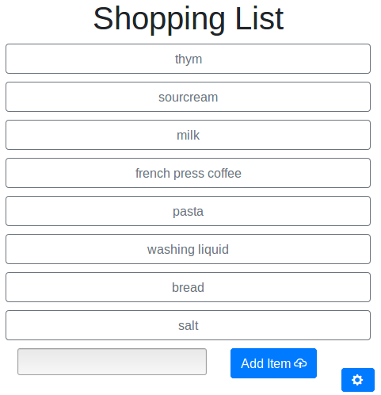

# Shoppinglist

An online shopping list with a simple webclient and a J2ME client to use on simple feature phones.
It has no password restrictions or anything like that. I just needed an online shopping list that was usable with a dumbphone.

## Screenshots
The webclient:

The J2ME client:

## Installation
### Server part

* Make sure you have PHP with SQLite extension installed.
* Copy the files from the folder `shoppinglist-server` somewhere and point your PHP-enabled webserver to it.
* Open the folder with a web browser. It should say: "shoppinglist server is up and running :)"

### Webclient part

* Copy the files from the folder `shoppinglist-webclient` somewhere and point your webserver to it.
* **Careful**: It may be that because of Cross-Origin restrictions the client cannot query the server. In this case, copy the client to a subfolder of the server part.
* Click on the settings button and enter the exact URL of the server part.

### J2ME part

* Transfer the .jar file from the folder `shoppinglist-j2meclient/dist` somehow to your phone and install it.
* Open the application. It should ask you for the server URL on first start. You can change that later.

## Develop

In the folder `shoppinglist-j2meclient`, you will find a NetBeans 6.5.1 project.
